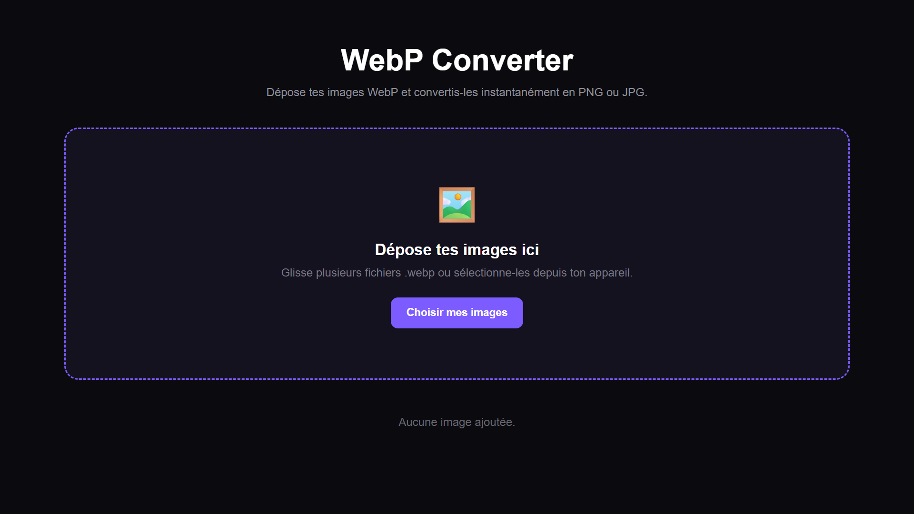

# 🖼️ WebP Converter

Un convertisseur d'images **WebP vers PNG ou JPG**, simple, rapide et entièrement exécuté dans le navigateur.

🌐 **Site en ligne :** https://viernoi86.github.io/webp/

Aucun fichier n'est envoyé sur un serveur : les images sont converties directement sur votre appareil grâce à **HTML, CSS et JavaScript**.

## ✨ Fonctionnalités

* 📂 Glisser-déposer de fichiers `.webp`
* 📁 Sélection de plusieurs images
* 🖼️ Aperçu des images avant conversion
* 📐 Affichage des dimensions des images
* 📦 Affichage de la taille des fichiers
* 🔄 Conversion **WebP → PNG**
* 🔄 Conversion **WebP → JPG**
* 🎚️ Choix de la qualité pour le JPG
* ⬇️ Téléchargement individuel
* 📥 Téléchargement de toutes les images
* 🗑️ Suppression individuelle des images
* 🧹 Suppression de toutes les images
* 📱 Interface responsive
* 🔒 Aucun upload vers un serveur

## 🌐 Utiliser le convertisseur

Aucune installation n'est nécessaire.

👉 **[Ouvrir WebP Converter](https://viernoi86.github.io/webp/)**

1. Ouvrez le site.
2. Déposez vos fichiers `.webp` dans la zone prévue.
3. Choisissez **PNG** ou **JPG**.
4. Pour le JPG, choisissez la qualité souhaitée.
5. Téléchargez vos images individuellement ou toutes en même temps.

## 🚀 Installation locale

Clonez le repository :

```bash
git clone https://github.com/viernoi86/webp.git
```

Puis ouvrez simplement :

```text
index.html
```

dans votre navigateur.

Aucune installation de dépendance n'est nécessaire.

## 🛠️ Technologies

Le projet utilise uniquement des technologies web natives :

* **HTML5**
* **CSS3**
* **JavaScript**
* **Canvas API**

Aucune bibliothèque ou framework externe n'est nécessaire.

## 📁 Structure

```text
webp/
│
├── index.html
└── README.md
```

Le projet fonctionne avec un seul fichier HTML contenant le HTML, le CSS et le JavaScript.

## 🔒 Confidentialité

Les images ne quittent pas votre appareil.

La conversion est effectuée localement avec la **Canvas API** du navigateur.

Aucun backend, aucune base de données et aucun service externe ne sont utilisés.

## 📱 Compatibilité

Le convertisseur fonctionne avec les navigateurs modernes prenant en charge la Canvas API :

* Chrome
* Edge
* Firefox
* Safari

## 📸 Aperçu

Ajoutez une capture d'écran du projet dans le repository :

```md

```

## 💡 Pourquoi ce projet ?

WebP Converter a été créé pour proposer un outil de conversion **rapide, léger, gratuit et sans inscription**.

Il permet de convertir facilement des images WebP en PNG ou JPG directement depuis son navigateur.

## 📄 Licence

Ce projet est disponible sous licence **MIT**.

Vous êtes libre de l'utiliser, le modifier et le redistribuer.

---

🌐 **Site :** https://viernoi86.github.io/webp/

⭐ Si ce projet vous est utile, n'hésitez pas à lui laisser une étoile sur GitHub.
